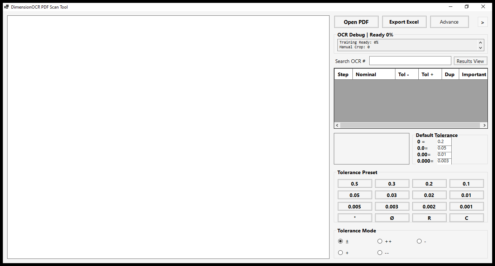
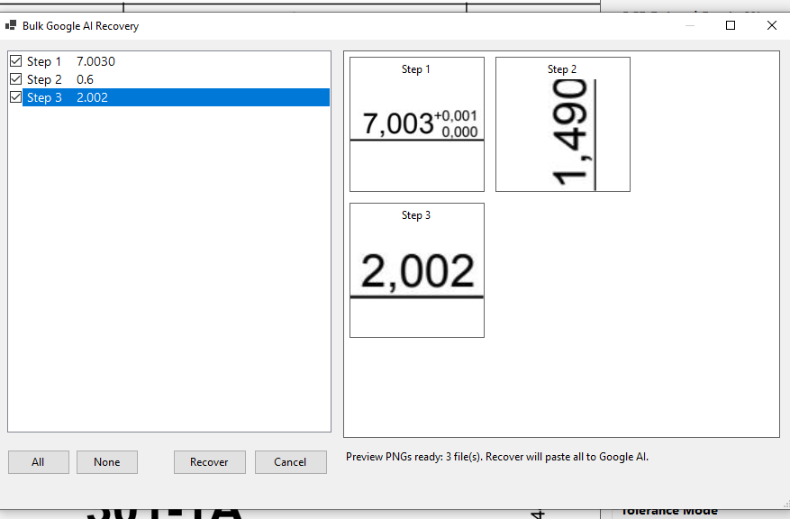
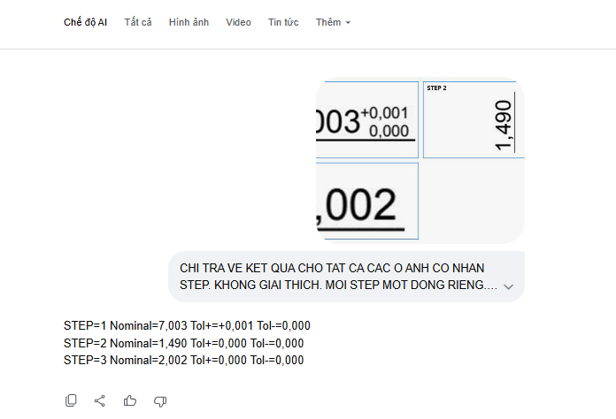
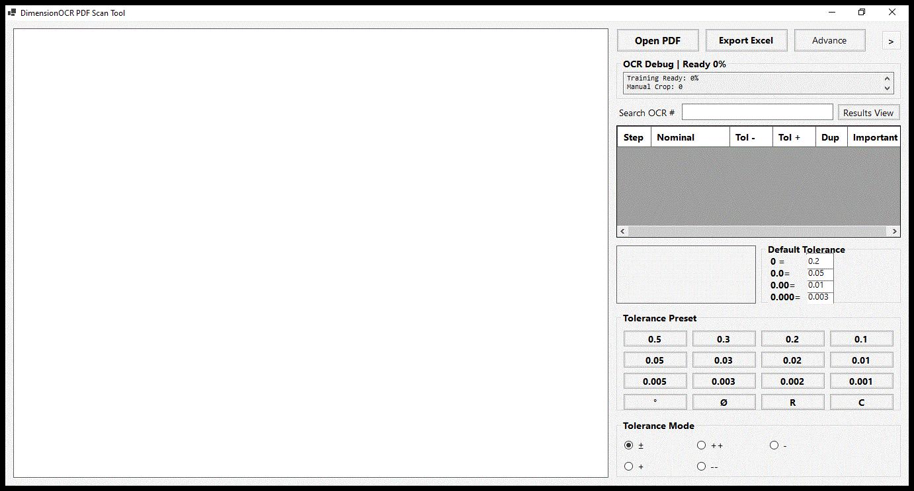

# DimesionOcr

DimensionOCR is a Windows PDF drawing OCR tool for extracting mechanical dimension callouts, reviewing them step by step, correcting tolerances, and exporting clean inspection data to Excel.

## Screenshots

| Main workspace | Bulk recovery preview |
| --- | --- |
|  |  |

| Contact sheet sent to AI | Google AI result format |
| --- | --- |
|  |  |

## What It Does

- Opens PDF drawings for dimension review.
- Detects and lists OCR steps in a table.
- Tracks nominal value, minus tolerance, plus tolerance, duplicate marks, and important marks.
- Supports manual crop correction for difficult callouts.
- Supports Bulk Google AI Recovery for selected OCR steps.
- Provides tolerance presets for common drawing formats.
- Exports reviewed results to Excel.

## Quick Start

1. Download the latest release package.
2. Extract the package to any folder.
3. Open the release folder.
4. Run `DimensionOcr.exe`.
5. Click `Open PDF`, or drag a PDF into the app.
6. Review OCR rows on the right side.
7. Fix values manually or use AI recovery.
8. Click `Export Excel` when the table is ready.

## Basic Workflow

1. Open a drawing PDF.
2. Let the app scan visible dimension callouts.
3. Select a row to inspect the matching step on the drawing.
4. Use tolerance preset buttons when a value needs a standard tolerance.
5. Mark duplicates or important dimensions when needed.
6. Export the final result table.

## Bulk Google AI Recovery

Bulk recovery is useful when OCR reads several dimensions incorrectly.

1. Select the rows that need recovery.
2. Open `Advance` then choose `Bulk Google AI Recovery`.
3. Check the steps you want to recover.
4. Review the crop previews.
5. Click `Recover`.
6. The app prepares one contact sheet image and sends it to Google AI.
7. Copy the returned step results back into the app workflow.

Expected AI result format:

```text
STEP=1 Nominal=7,003 Tol+=0,001 Tol-=0,000
STEP=2 Nominal=1,490 Tol+=0,000 Tol-=0,000
STEP=3 Nominal=2,002 Tol+=0,000 Tol-=0,000
```

## Tips

- Use clear PDF views for better recognition.
- Zoom or crop around crowded dimensions before recovery.
- Use comma or dot decimals consistently in one review session.
- Always review the table before exporting.
- Keep the release folder together; support files are required even if they are hidden.

## Preview



## Platform

- Windows desktop
- PDF drawing workflow
- Excel export workflow

## License

This project is released under the repository license.
